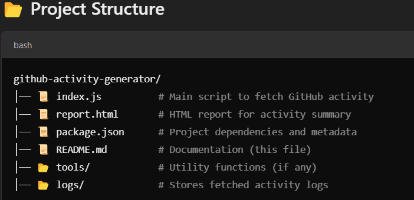
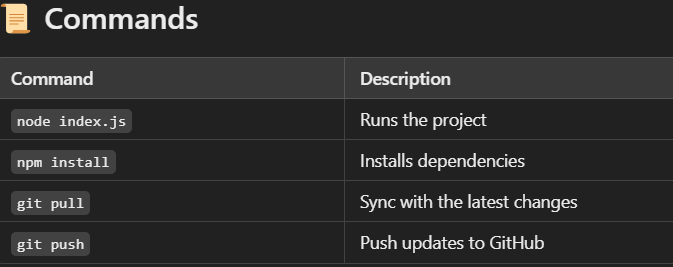
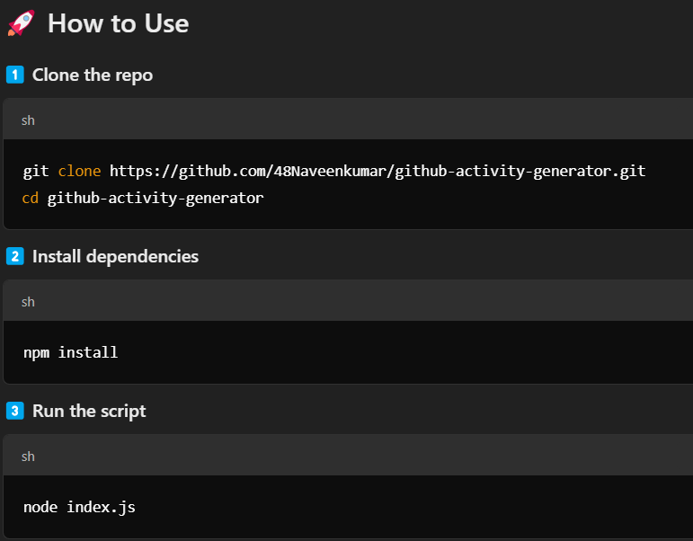

# 🚀 GitHub Activity Generator  

A **Node.js** tool that fetches **GitHub activity** using the GitHub API and **Moment.js**. It helps developers track their contributions efficiently.  

## 🔥 Why This Project?  
✅ Automates fetching GitHub activity  
✅ Filters key events (Push, PR, Issues)  
✅ Provides a **JSON report** and an **HTML summary**  
✅ Simple CLI-based usage  

---

## 🛠️ Tech Stack  
- **Node.js** 🟢  
- **GitHub API** 🐙  
- **Moment.js** ⏳  
- **JavaScript (ES6+)**  

---

## 📌 Modules Installed  
Run the following command to install dependencies:  

```sh
npm install

Modules used:
  *  Axios 📡 → For API requests
  *  moment ⏳ → For date formatting
  *  FS📂 → File system operations

🎯 Purpose of Each File
  index.js → Core logic to fetch and process GitHub activity
  report.html → Displays the activity log in a readable format
  package.json → Contains dependencies & project metadata
  README.md → Project documentation

💡 Features
✅ Fetches GitHub activity for any user
✅ Supports filtering by event types (Push, PRs, Issues)

## Screenshots

### Project Structure


### Commands


### How to Use


✅ Saves data to a structured JSON file
✅ Outputs a formatted HTML report

📝 License
This project is open-source under the MIT License.

